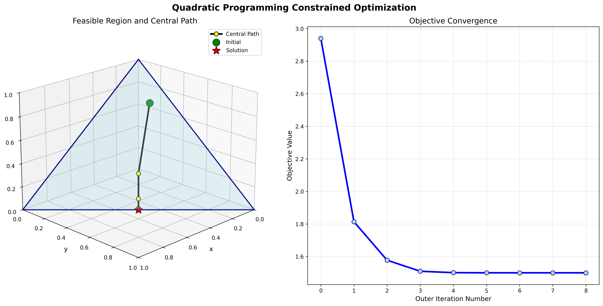
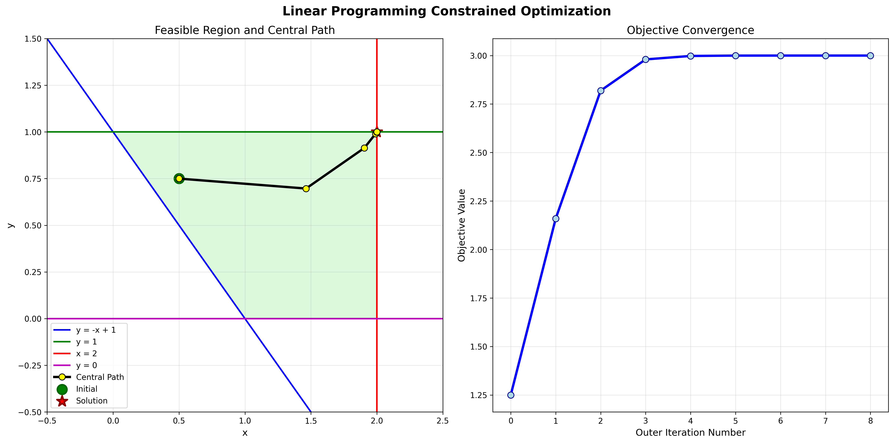

# Numerical Optimization with Python
## Programming Assignment 02
**Author:** Gabriel Mazor

[GitHub Link](https://github.com/gabrielmazor/mlds-numerical-optimization)

---
### Quadratic Programming
> **Final Candidate:**   Objective value: 1.500, Optimal point: [4.99999950e-01 4.99999950e-01 9.99898707e-08]

---
### Linear Programming
> **Final Candidate:**    Objective value: 3.000, Optimal point: [1.9999999 0.9999999]

---
