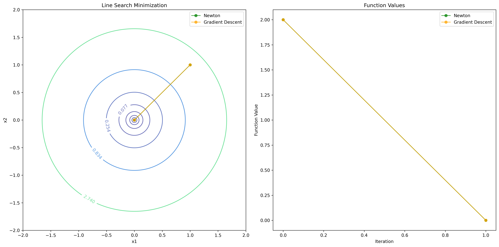
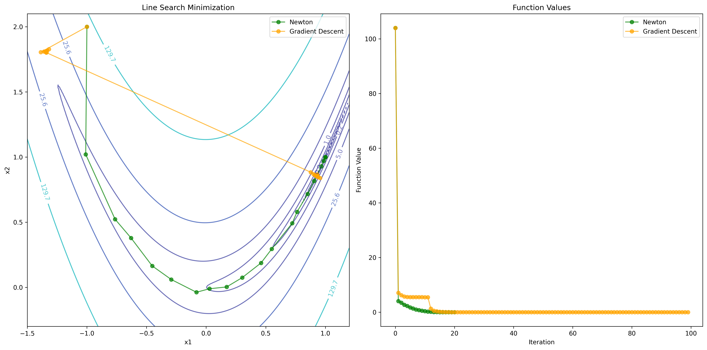

# Numerical Optimization with Python
## Programming Assignment 01 
**Author:** Gabriel Mazor

[GitHub Link](https://github.com/gabrielmazor/mlds-line-search-minimization/tree/main)

---
### Quadratic Function 1
> **Newton:**   Iteration 1: x = [0. 0.], f(x) = 0.0, a = 1, Success: True 

> **Gradient Descent:**   Iteration 1: x = [0. 0.], f(x) = 0.0, a = 1, Success: True

---
### Quadratic Function 2
> **Newton:**   Iteration 1: x = [0. 0.], f(x) = 0.0, a = 1, Success: True

> **Gradient Descent:**   Iteration 99: x = [ 0.11450918 -0.00157439], f(x) = 0.013360223501345091, a = 0.0078125, Success: False

---
### Quadratic Function 3
> **Newton:**   Iteration 1: x = [-6.21724894e-15 -1.06581410e-14], f(x) = 3.7778922902100486e-29, a = 0.5, Success: True

> **Gradient Descent:**   Iteration 99: x = [0.40173821 0.69499052], f(x) = 0.1608269561472648, a = 0.0078125, Success: False

---
### Rosenbrock Function 
> **Newton:**   Iteration 20: x = [0.99999999 0.99999998], f(x) = 2.7300933598972337e-16, a = 1, Success: True

> **Gradient Descent:**   Iteration 7751: x = [0.99989437 0.99978771], f(x) = 1.1267173492101773e-08, a = 0.001953125, Success: True

---
### Linear Function 
> **Newton:**   N/A

> **Gradient Descent:**   Iteration 99: x = [-197.  -543.5], f(x) = -3383.25, a = 1, Success: False

---
### Exponental Function 
> **Newton:**   Iteration 8: x = [-3.4657359e-01  6.8068820e-12], f(x) = 2.5592666966582156, a = 1, Success: True

> **Gradient Descent:**   Iteration 29: x = [-3.46572886e-01 -9.76799665e-07], f(x) = 2.559266696664345, a = 0.125, Success: True

---